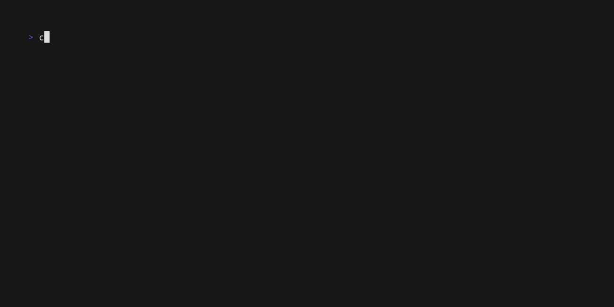

# Todo App



A full-stack Todo app written in Rust, with asynchronous REST API backend, and a
responsive TUI built with [Ratatui](https://github.com/ratatui/ratatui)

## Features

- **Distributed**: Decoupled client-server model using REST
- **Async Backend**: High performance API built with [Axum](https://github.com/tokio-rs/axum) and [Tokio](https://github.com/tokio-rs/tokio)
- **Type-Safe Persistence**: SQLite database accessed via [SQLx](https://github.com/launchbadge/sqlx)
- **Interactive TUI**: Interface built with [Ratatui](https://github.com/ratatui/ratatui), with non-blocking UI event loop, and Vi[m]-inspired modes

## Setup & Installation

- Prerequisites

- Rust & Cargo (**Latest stable**)
- `sqlx-cli` (For database setup)
  - `cargo install sqlx-cli --no-default-features --features native-tls,sqlite`

### Database Setup

```{bash}
# 1. Create .env file at workspace root (next to .env.example)
echo "DATABASE_URL=sqlite:todos.db" > .env

# 2. Create database file
cargo sqlx database create

# 3 Run migrations to create schema
cargo sqlx migrate run --source crates/todo-server/migrations
```

### Running

> Run commands in root directory of the workspaces

1. Start server in one terminal
   - `cargo run -p todo-server`
2. Start client in another terminal
   - `cargo run -p todo-tui`
